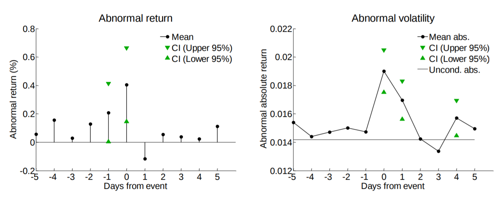
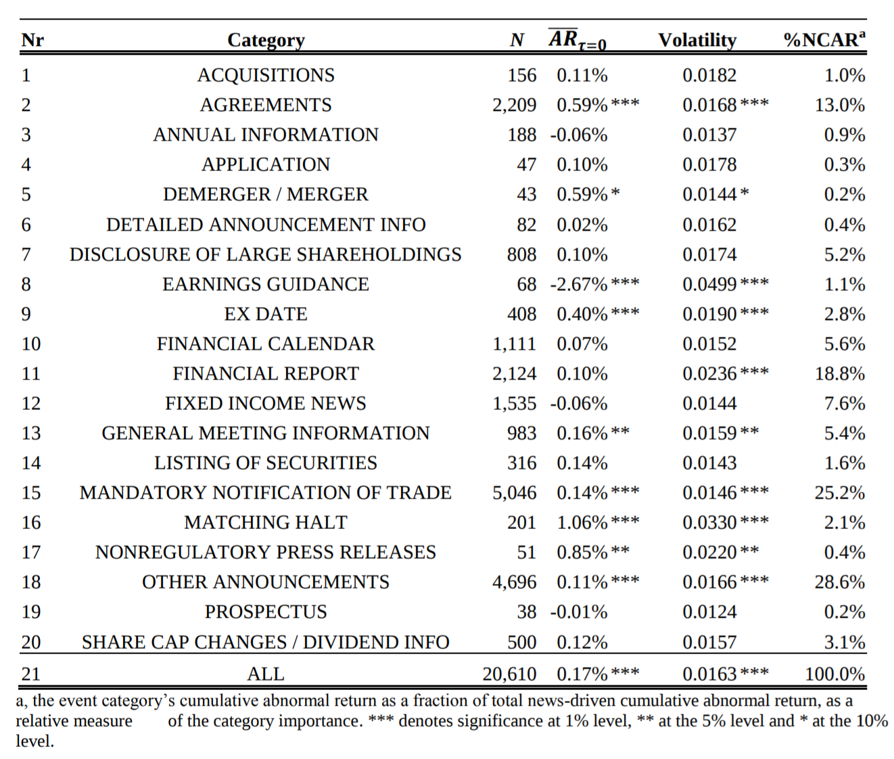

# eventstudyTools
Interactive data exploration and stock price predictions based on news and company events

## About the project
This repository includes financial event study tools built to enable my master's thesis in Economic Analysis at the Norwegian School of Economics (NHH). Given stock price data and a database of news and events, it has a range of features for empirical inference of how stock prices react to new information. The examples below are based on the most recent 20,000 events related to the 35 largest companies on the Oslo Stock Exchange. 

<!---[First equation](https://latex.codecogs.com/gif.latex?\dpi{400}\alpha&space;+&space;\frac{2\beta}{\gamma})--->

<!---[Second equation](http://latex.codecogs.com/gif.latex?%5Cfrac%7Ba%7D%7Bb%7D)--->

<!---[Third equation](https://latex.codecogs.com/svg.latex?\sum_{i=1}^{n}sqrt(3sin(i)))--->

<!---[Third equation](https://latex.codecogs.com/gif.latex?\dpi{200}\sum_{i=1}^{n}\sqrt(3sin(i)))--->

<!---[alt1](https://wikimedia.org/api/rest_v1/media/math/render/svg/583cca32cbdd337bcc4b07c5748fb2ba2c1184c8)--->

## Highlight 1: Event windows
Automatic generation of **event windows**. As an example, here is the interesting event of *DIVIDEND PAYMENTS*, indicating the profitable strategy of buying ahead of a company's payout of dividends:

The **event windows** can easily be tailored and explored interactively to pursue any news or event of interest, finding possible market inefficiencies ranging from insider trading and information leakage, to naturally occurring opportunities in the markets.

<!------>

## Highlight 2: Aggregation of event statistics
It includes capabilities for revealing how, on average, each type of event impacts stock prices, for instance on the day of the event, here in terms of **abnormal return** (AR):

## How abnormal return (AR) is calculated

First, **volatility clustering**, seen in grey in the figure below (for the example company [YARA](https://www.yara.com/)), is handled by generalized autoregressive conditional heteroskedasticity [(GARCH)](https://en.wikipedia.org/wiki/Autoregressive_conditional_heteroskedasticity) modeling:

Then, a dynamic **market model** for time-varying dependency (solving limitations of static [OLS](https://en.wikipedia.org/wiki/Ordinary_least_squares) based [CAPM)](https://en.wikipedia.org/wiki/Capital_asset_pricing_model), using a [Kalman filter](https://en.wikipedia.org/wiki/Kalman_filter) inspired by the work of [Mergner and Bulla](https://www.tandfonline.com/doi/full/10.1080/13518470802173396), models the (varying) [market beta](https://en.wikipedia.org/wiki/Beta_(finance)), of example company YARA, as seen below:

# Descriptive statistics
Finally, tables with relevant statistics are produced efficiently, here for the 35 companies included in this particular study:

